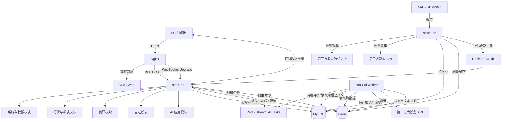
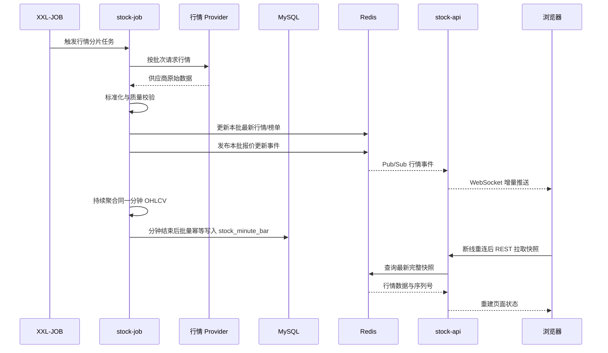
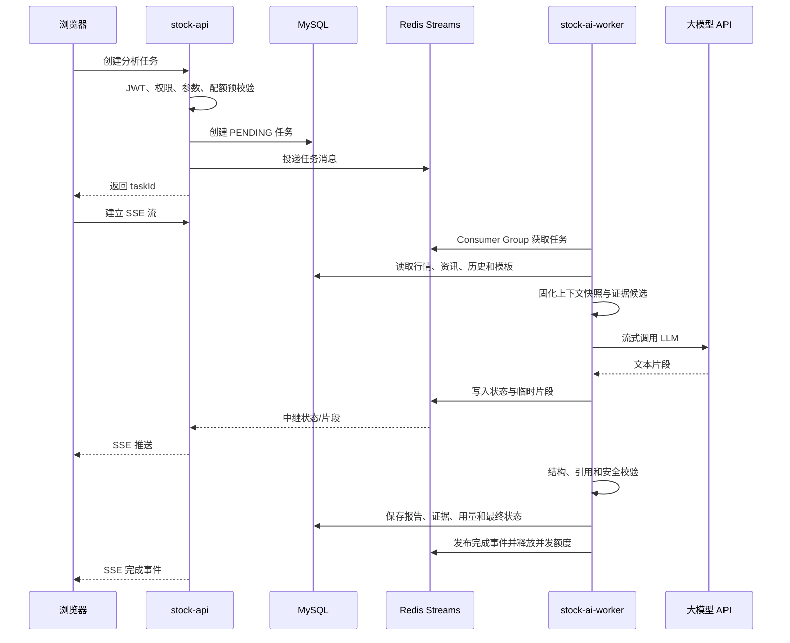
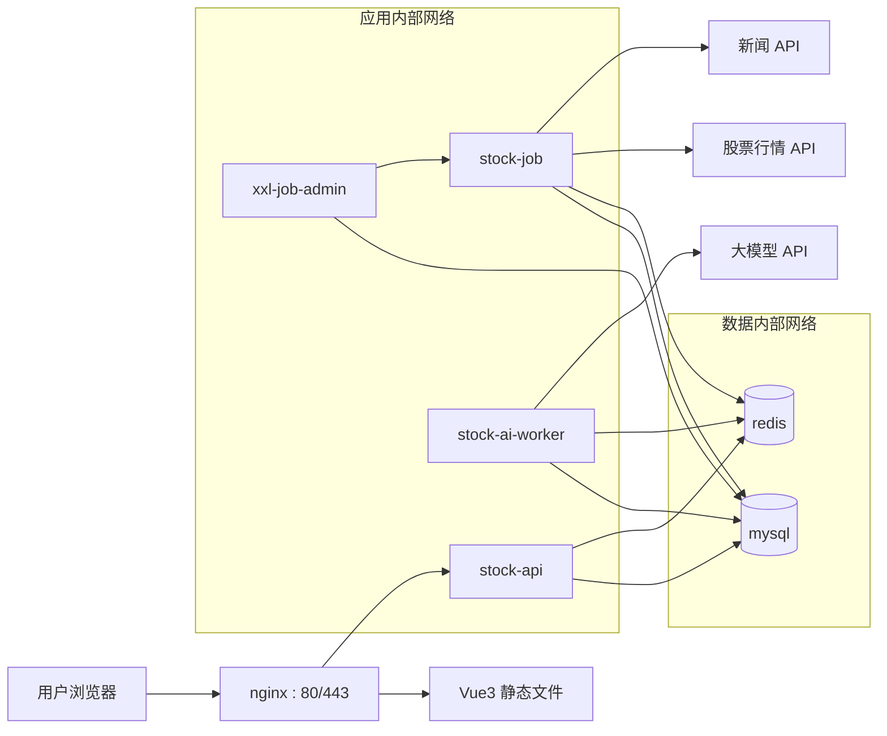

# AI 智能股票分析平台系统架构设计

| 文档属性 | 内容 |
| --- | --- |
| 项目名称 | AI 智能股票分析平台 |
| 文档版本 | V1.0 |
| 文档状态 | 架构评审稿 |
| 编制日期 | 2026-09-08 |
| 关联需求 | `docs/AI智能股票分析平台-PRD.md` |
| 参考资料 | `docs/01-项目介绍与工程搭建.pdf`、`sql/stock_db.sql` |
| 首期部署 | 单台 Linux 服务器，Docker Compose 容器化部署 |
| 目标容量 | 500 个并发浏览会话、30 个并发 AI 生成任务 |

> 本文定义系统边界、模块职责、数据归属、实时链路和部署拓扑，不包含具体业务代码或数据库 DDL。

## 1. 架构结论

### 1.1 最终选型

采用“PDF 原有 Maven 多模块架构的产品化升级版”，架构形态为：

**模块化单体代码库 + 3 个独立 Spring Boot 运行进程 + MySQL/Redis 共享基础设施 + Nginx/Vue3 前端 + Docker Compose 单机部署。**

三个运行进程分别为：

1. `stock-api`：在线 API、JWT 鉴权、WebSocket 行情推送、AI 任务入口和 SSE 结果流。
2. `stock-job`：股票、指数、板块、新闻采集，以及 K 线聚合、缓存预热和数据清理。
3. `stock-ai-worker`：异步消费 AI 任务、构建分析上下文、调用大模型、校验证据并持久化结果。

该方案保留 PDF 中 `stock_parent + stock_common + stock_backend + stock_job` 的核心思路，同时增加清晰的业务模块和 AI Worker。当前规模不引入完整微服务、服务注册中心、独立 API 网关、Kafka/RabbitMQ 或分布式事务。

### 1.2 为什么采用 PDF 的方案

PDF 已经做出了两个正确的基础决策：

- 使用 Maven 父工程聚合 `stock_common`、`stock_backend` 和 `stock_job`，统一依赖并隔离在线服务与采集任务。
- 将股票终端展示系统、股票采集系统、缓存服务和数据库存储拆成不同职责区域。

本架构不推翻该方案，而是在真实互联网项目要求下补齐实时推送、AI 异步任务、资讯处理、缓存事件、容器化、可观测性和安全边界。

### 1.3 PDF 技术的采用与调整

| PDF 中的技术/设计 | 决策 | 本架构中的处理 |
| --- | --- | --- |
| Maven 父工程与多模块 | 保留 | 继续使用父 POM 管理版本与三个可执行 Spring Boot 应用 |
| `stock_common` | 保留但收紧 | 仅存放稳定通用能力，不再堆放所有业务实体和 Mapper |
| `stock_backend` | 保留并升级 | 作为 `stock-api` 在线服务，增加 JWT、WebSocket、SSE、限流和管理接口 |
| `stock_job` | 保留并升级 | 作为独立采集/聚合进程，使用 XXL-JOB 管理业务定时任务 |
| Spring Boot / Spring MVC | 保留 | 作为在线服务与后台进程基础框架 |
| MyBatis | 替换 | 使用 MyBatis-Plus；复杂行情统计保留自定义 SQL 能力 |
| Spring Security + JWT | 保留并完善 | 访问令牌、刷新会话、对象级鉴权、Token 撤销与权限缓存 |
| Redis + Spring Cache | 保留并扩展 | 缓存、会话、限流、锁、Redis Streams、Pub/Sub 和 WebSocket 事件 |
| XXL-JOB | 保留 | 提供任务编排、分片、失败重试、人工重跑和运行记录 |
| Sharding-JDBC | MVP 不采用 | 单机 MySQL 先使用合理索引、批量写入和时间分区；达到阈值后再评估分片 |
| EasyExcel | 保留 | 用于榜单 Excel 导出 |
| Nginx + Linux | 保留 | 托管 Vue 静态资源，代理 REST、SSE 与 WebSocket，终止 TLS |
| Vue CLI + Vue + Element | 升级 | Vue3 + Vite + TypeScript + Element Plus |
| ECharts | 保留 | 分时、K 线、指数、成交趋势和市场广度可视化 |

## 2. 架构目标与约束

### 2.1 架构目标

1. 行情查询与采集、AI 长任务相互隔离，任一外部服务故障不拖垮在线 API。
2. 交易时段核心行情延迟不超过 60 秒，并能通过 WebSocket 推送页面订阅的变化。
3. AI 首段内容 P95 不超过 5 秒、完整结果 P95 不超过 30 秒，60 秒后进入超时状态。
4. MySQL 保证最终业务数据，Redis 中的数据在丢失后均可重建或通过 MySQL 恢复。
5. 单机 Compose 能完成开发、测试和 MVP 生产部署，未来可以逐个横向扩展无状态进程。
6. 外部行情、新闻和大模型 API 都具有超时、限流、重试、熔断、降级和可观测能力。
7. 模块边界与未来 FastAPI 拆分边界一致，避免重写前端协议和核心数据对象。

### 2.2 当前约束

- MVP 仅支持 PC Web 和中国 A 股，国外指数只作市场环境参考。
- 首期为单台 Linux 服务器，MySQL 和 Redis 在 Compose 内为单实例，是明确接受的单点。
- 现有 SQL 只有行情、主营业务、用户权限和日志表，需在后续数据库设计中增加 PRD 定义的数据对象。
- 现有实时表可沿用数据含义，但需要补充证券主数据、交易所、交易日历、数据源和规则版本。
- 表关联继续由应用层维护，不强制增加外键；必须通过唯一索引、事务和应用校验保证完整性。
- 所有服务统一使用 `Asia/Shanghai` 业务时区，数据库内部时间字段语义必须明确。

## 3. 整体系统架构

### 3.1 逻辑架构图



### 3.2 部署单元

| 部署单元 | 类型 | 是否有状态 | 是否可横向扩展 | 核心职责 |
| --- | --- | --- | --- | --- |
| `nginx` | 容器 | 否 | 可 | Vue 静态资源、TLS、反向代理、压缩、缓存头、WebSocket/SSE 代理 |
| `stock-api` | Spring Boot 容器 | 否 | 可 | REST、JWT、RBAC、WebSocket、SSE、在线业务编排 |
| `stock-job` | Spring Boot 容器 | 任务状态外置 | 受控扩展 | 外部数据采集、聚合、预热、清理和补偿 |
| `stock-ai-worker` | Spring Boot 容器 | 任务状态外置 | 可 | AI 任务消费、上下文构建、模型调用、结果校验和持久化 |
| `mysql` | MySQL 容器 | 是 | 首期不可 | 最终业务数据、历史行情、资讯、AI 报告和审计 |
| `redis` | Redis 容器 | 是但可重建 | 首期不可 | 热行情、会话、配额、任务流、锁、事件和短期流式内容 |
| `xxl-job-admin` | 调度容器 | 元数据持久化 | 首期单实例 | 任务配置、触发、分片、失败告警、运行日志和人工重跑 |
| `prometheus` | 可观测容器 | 是 | 首期单实例 | 拉取并保存指标，使用 Compose `observability` profile 启用 |
| `grafana` | 可观测容器 | 是 | 首期单实例 | 指标和业务运行看板 |
| `loki/promtail` | 可观测容器 | 是 | 首期单实例 | 汇聚容器日志并按追踪 ID 检索 |

### 3.3 请求边界

- 用户请求只进入 Nginx 和 `stock-api`，不直接访问数据库、Redis、XXL-JOB 或第三方 API。
- `stock-job` 是行情和资讯外部 API 的唯一常规调用方，在线请求不穿透到行情/新闻供应商。
- `stock-ai-worker` 是大模型 API 的唯一业务调用方，`stock-api` 只负责创建、查询、取消和转发任务结果。
- 外部服务凭证仅存在于相应后台进程的容器 Secret/环境配置中。

## 4. 组件职责

| 组件 | 职责 | 不负责 |
| --- | --- | --- |
| Vue3 Web | 页面路由、状态展示、表单校验、ECharts、WebSocket 订阅、SSE 消费、登录恢复 | 不计算权威行情指标，不直接调用第三方 API，不保存长期业务数据 |
| Nginx | 静态文件、TLS、REST/SSE/WS 代理、安全头、基础频率保护 | 不承载业务鉴权和业务路由逻辑 |
| `stock-api` | REST 接口、JWT/RBAC、对象权限、查询编排、自选/历史写入、WebSocket 会话、AI 任务 API | 不执行定时采集，不直接执行 LLM 长任务 |
| `stock-job` | 定时采集、数据标准化、幂等写入、K 线/榜单聚合、缓存预热、数据清理、任务补偿 | 不向浏览器提供 API，不保存用户会话 |
| `stock-ai-worker` | AI 消费组、上下文快照、提示模板、LLM Provider、输出校验、引用绑定、报告持久化 | 不负责用户登录、页面接口和行情采集 |
| MySQL | 最终一致的业务事实和可审计历史 | 不承担秒级热点广播、连接状态和高频配额计数 |
| Redis | 热点读、JWT 会话、验证码、限流、锁、幂等键、AI Streams、Pub/Sub、WS 事件 | 不作为账户、自选、资讯或 AI 报告的唯一存储 |
| XXL-JOB | 业务定时任务的可视化调度、分片、重试和告警 | 不承载业务数据处理逻辑，执行逻辑仍在 `stock-job` |
| 行情 API | 提供证券主数据、交易状态、指数、板块和个股行情 | 不被浏览器直接调用 |
| 新闻 API | 提供有授权的新闻/公告及来源信息 | 不直接作为未经清洗的 AI 指令输入 |
| 大模型 API | 根据结构化上下文生成候选分析文本 | 不决定权限、数据真实性、引用关系和最终安全状态 |

## 5. Spring Boot 模块划分

### 5.1 Maven 工程结构

```text
stock-parent                         # 父 POM：版本、插件、构建规则
├── stock-common                     # 稳定通用能力，无业务表 Mapper
├── stock-system                     # 用户、JWT、RBAC、验证码、审计
├── stock-market                     # 证券主数据、行情、指数、板块、榜单、K 线
├── stock-news                       # 新闻公告、去重、关联和来源状态
├── stock-watchlist                  # 自选分组、自选项和自选查询
├── stock-ai                         # AI 任务、上下文、报告、证据、反馈和配额规则
├── stock-integration                # 行情、新闻、邮件、大模型等外部适配器
├── stock-backend                    # 可执行：stock-api
├── stock-job                        # 可执行：行情/资讯/聚合任务进程
└── stock-ai-worker                  # 可执行：AI 异步任务进程
```

这比 PDF 原始三模块多出业务边界模块，但仍是同一仓库、同一版本、同一数据库的模块化单体，不是微服务系统。

### 5.2 模块职责

| 模块 | 主要职责 | 主要依赖 | 禁止事项 |
| --- | --- | --- | --- |
| `stock-common` | 统一结果、错误码、分页、值对象、时间/ID、脱敏、追踪上下文 | 尽量只依赖 JDK 和少量稳定库 | 不放用户、行情、资讯等业务实体，不放通用 Mapper |
| `stock-system` | 用户、角色、权限、登录、刷新会话、验证码、账户锁定和审计 | common、MyBatis-Plus、Redis、JWT | 不直接读取其他模块 Mapper，不记录密码/Token 明文 |
| `stock-market` | 证券主数据、交易日历、实时快照、指数、板块、排行、分时和 K 线 | common、MyBatis-Plus、Redis | 不直接调用第三方 API；通过 Port 接收标准化数据 |
| `stock-news` | 新闻/公告模型、来源、去重、股票/板块关联、授权范围 | common、MyBatis-Plus、Redis | 不把未清洗正文直接暴露给 AI |
| `stock-watchlist` | 自选分组、项目、排序、用户隔离和自选行情视图编排 | common、system 契约、market 查询契约 | 不拥有股票行情，不跨用户查询 |
| `stock-ai` | 任务状态机、上下文构建、模板版本、证据、报告、反馈、配额和安全规则 | common、market/news 查询契约、Redis、MyBatis-Plus | 不在 Controller 线程中执行 LLM，不信任模型生成的引用 |
| `stock-integration` | 行情 Provider、新闻 Provider、LLM Provider、邮件 Provider 的客户端实现 | 各模块定义的 Port、WebClient、Resilience4j | 不包含业务决策，不向上泄露供应商原始对象 |
| `stock-backend` | Spring Boot 启动、Controller、参数校验、鉴权过滤器、OpenAPI、WebSocket、SSE、异常映射 | 所有前台业务模块，按需装配 integration | 不写跨模块 SQL，不执行采集和 AI 长任务 |
| `stock-job` | Spring Boot 启动、XXL-JOB Handler、批处理和补偿入口 | market、news、integration、common | 不承载用户请求，不依赖 backend |
| `stock-ai-worker` | Spring Boot 启动、Redis Stream Consumer、模型调用与结果中继 | ai、market、news、integration、common | 不依赖 backend，不开放公开业务接口 |

### 5.3 模块内部结构

每个业务模块使用一致的四层结构：

1. `domain`：业务规则、领域对象、状态机和外部 Port 接口。
2. `application`：用例服务、事务边界、DTO 组装和跨模块契约调用。
3. `infrastructure`：MyBatis-Plus Mapper/Repository、Redis Adapter 和外部 Port 实现绑定。
4. `interfaces`：仅在可执行模块中出现，包括 REST Controller、WebSocket Handler、SSE Handler、XXL-JOB Handler 和 Stream Consumer。

依赖方向固定为 `interfaces -> application -> domain`，`infrastructure` 实现 `domain` 定义的端口。禁止 Controller 直接调用 Mapper，也禁止业务模块直接引用其他模块的 Mapper、数据库实体或内部 Service 实现。

### 5.4 三个运行进程的装配范围

| 进程 | 装配模块 | 线程资源隔离 |
| --- | --- | --- |
| `stock-api` | system、market、news、watchlist、ai 查询/任务入口 | HTTP、WebSocket 广播、SSE 各自使用有界线程池或事件循环 |
| `stock-job` | market 写入、news 写入、integration Provider、任务 Handler | 行情、新闻、聚合、清理使用独立有界执行器，避免相互饿死 |
| `stock-ai-worker` | ai 执行、market/news 只读契约、LLM integration | AI 并发受信号量和 Provider 限流器控制，默认单用户最多 2 个并发任务 |

## 6. 前端架构

### 6.1 技术选型

| 技术 | 用途 | 选型理由 |
| --- | --- | --- |
| Vue3 | UI 框架 | 满足用户指定要求，Composition API 适合复杂行情组件 |
| Vite | 构建工具 | 开发反馈快，替代 PDF 中较旧的 Vue CLI/Webpack 组合 |
| TypeScript | 类型约束 | 约束行情、WebSocket 事件和 AI 状态，降低字段误用 |
| Vue Router | 页面路由和权限路由 | 支持公开、登录和管理端路由守卫 |
| Pinia | 全局状态 | 管理用户、权限、市场状态、自选摘要和连接状态 |
| Axios | REST 请求 | 统一认证、追踪 ID、错误映射和重试策略 |
| Fetch Stream | AI SSE/流式响应 | 浏览器可携带 Authorization Header 并处理流式文本 |
| 原生 WebSocket 封装 | 实时行情 | 使用简洁 JSON 协议，避免为当前规模引入 STOMP Broker |
| Element Plus | 基础组件 | 延续 PDF 的 Element 设计方向并适配 Vue3 |
| ECharts | 行情图表 | 支持分时、K 线、成交量和市场广度图表 |
| Vitest + Playwright | 单元与端到端测试 | 覆盖状态管理、数据格式和核心用户流程 |

### 6.2 前端模块

- `app-shell`：布局、导航、权限路由、全局搜索和错误边界。
- `market`：市场总览、指数、榜单、板块和图表。
- `stock`：个股行情、分时/K 线、主营业务和资讯。
- `ai-research`：任务配置、流式内容、证据、追问和反馈。
- `watchlist`：分组、排序、订阅和多标的选择。
- `information`：新闻/公告列表、筛选和原文跳转。
- `account`：注册、登录、找回密码和个人中心。
- `admin`：用户、角色、权限、日志和运行状态。
- `shared`：API Client、类型、格式化、权限指令、WebSocket/SSE 客户端和通用组件。

### 6.3 前端状态边界

- URL 保存可分享的筛选、排序、分页、标的和时间范围。
- Pinia 只保存跨页面会话状态，不把大规模 K 线和完整 AI 历史长期放入全局 Store。
- 最新行情由 REST 首次加载，WebSocket 增量更新；断线重连后通过 REST 重建快照。
- Access Token 只保存在内存，Refresh Token 使用 `HttpOnly + Secure` Cookie；页面刷新通过刷新会话恢复登录。
- AI 任务由任务 ID 驱动，刷新页面后先查任务状态，再决定恢复流式订阅或读取最终报告。

## 7. 数据架构

### 7.1 数据归属原则

1. MySQL 保存需要长期存在、参与审计、支持历史查询或必须最终一致的数据。
2. Redis 保存有明确 TTL、可从 MySQL/外部源重建、需要高频读取或需要原子计数的数据。
3. 浏览器请求不直接查询第三方行情或新闻 API，避免供应商抖动和限流直接传导给用户。
4. 行情写入遵循“标准化 -> 质量校验 -> Redis 最新快照 -> 发布更新事件”；同一分钟内的合格报价另行聚合，并在分钟结束后批量幂等写入 MySQL 的规范分钟 OHLCV 表。实时快照更新与分钟持久化采用不同节奏，不要求每次轮询先写 MySQL。
5. 用户和 AI 写操作先落 MySQL；Redis 更新失败时由删除缓存、补偿任务或过期机制恢复，不把缓存成功视为业务成功。

### 7.2 MySQL 存储内容

#### 7.2.1 现有表的归属与处理

| 现有表 | 归属模块 | 架构处理 |
| --- | --- | --- |
| `stock_rt_info` | market | 作为已有历史快照和旧查询的过渡兼容表；新链路不再把它作为高频主写表，最新报价进入 Redis，规范分钟 OHLCV 进入 `stock_minute_bar`；迁移完成前提供只读兼容适配 |
| `stock_market_index_info` | market | 保留国内指数时间序列，按 1 分钟粒度批量写入 |
| `stock_outer_market_index_info` | market | 保留国外指数时间序列；按对应市场时区采集，统一保存明确时间戳 |
| `stock_block_rt_info` | market | 保留板块快照；统一 `label` 业务标识并补充按标识查最新数据的索引 |
| `stock_business` | market | 保留主营业务和板块基础信息；逐步拆分/补充证券主数据，不作为唯一证券身份来源 |
| `sys_user` | system | 保留账户；补充邮箱唯一性、密码策略相关字段或配套数据 |
| `sys_role`、`sys_permission` | system | 保留 RBAC；增加唯一约束、版本/并发控制和必要索引 |
| `sys_user_role`、`sys_role_permission` | system | 保留关联；增加防重复联合唯一索引和查询索引 |
| `sys_log` | system | 保留审计用途；统一 `user_id` 与用户主键类型，参数改为白名单脱敏摘要 |

#### 7.2.2 需要新增的数据域

| 数据域 | 建议数据对象/表 | 保存内容 | 保留策略 |
| --- | --- | --- | --- |
| 证券主数据 | `stock_security` | 交易所、代码、名称、证券类型、上市/停牌/ST 状态、价格精度、板块关系 | 长期保存，状态按生效时间审计 |
| 交易规则 | `stock_trade_calendar`、`stock_limit_rule` | 交易日、交易时段、市场/板块涨跌停规则与生效区间 | 长期保存，规则版本不可覆盖历史 |
| 分时/K 线 | `stock_minute_bar`、`stock_kline_day` | 1 分钟 OHLCV、日 K；周/月 K 可查询时聚合或物化 | 分钟数据至少 90 天，日 K 至少 5 年 |
| 资讯来源 | `news_source` | 来源、授权状态、健康状态、抓取游标和最后成功时间 | 合同/授权有效期内长期保存 |
| 新闻公告 | `stock_news`、`stock_news_relation` | 标题、授权摘要、类型、原文链接、发布时间、指纹、证券/板块关联与置信状态 | 最长 3 年，受授权期限约束 |
| 自选股 | `user_watchlist_group`、`user_watchlist_item` | 用户分组、股票、排序和时间 | 用户删除或账户清理前保存 |
| AI 任务 | `ai_task` | 用户、场景、目标、请求摘要、状态、重试、截止时间、追踪 ID | 至少 180 天，之后按审计策略归档/清理 |
| AI 会话 | `ai_session`、`ai_message` | 会话标题、消息、角色、顺序、状态和数据截止时间 | 用户删除后进入 30 天清理期 |
| AI 报告/证据 | `ai_report`、`ai_evidence` | 固定章节、受限原因、模板/模型版本、证据编号、来源与快照摘要 | 与会话一致；完成结果不可静默覆盖 |
| AI 反馈/用量 | `ai_feedback`、`ai_usage` | 点赞/点踩原因、Token、耗时、Provider、模型和成本估算 | 聚合指标长期保留，用户文本随报告清理 |
| 任务执行摘要 | `job_execution_summary` | 任务、分片、批次、数据量、状态、错误摘要和追踪 ID | 180 天；XXL-JOB 仍保存自身调度日志 |

> 表名用于明确数据边界，最终字段与索引在数据库设计阶段形成单独 DDL。不得直接在现有大体量初始化 SQL 中手工追加生产迁移，应使用 Flyway 管理增量版本。

### 7.3 高频行情存储策略

第三方行情 API 的原始响应不原样长期落库，避免供应商字段耦合和无效数据膨胀。数据流程如下：

1. `stock-job` 按批次获取行情并转换为内部标准模型。
2. 每次轮询得到的最新报价写入 Redis，供页面和 WebSocket 使用。
3. 同一分钟内的多次报价在内存/Redis 中聚合为 1 分钟 OHLCV，只将分钟结果批量写入 MySQL。
4. 收盘后从分钟数据生成日 K，并执行数量、时间、开高低收关系等完整性校验。
5. 周/月 K 由日 K 按交易日历聚合；MVP 默认不复权。
6. 分钟表按交易日期分区或分表管理；保留期到达后按分区清理，禁止逐行大事务删除。

建议为高频表同时提供“标的 + 时间倒序”与“时间范围”访问路径。现有 `cur_time + stock_code` 唯一索引适合幂等写入，但不足以高效查询某只股票的最新 N 条数据，需要补充适合标的时间序列查询的索引。

### 7.4 Redis 存储内容与 TTL

| Key 类别（逻辑命名） | 数据结构 | 内容 | 建议 TTL/策略 |
| --- | --- | --- | --- |
| `quote:stock:{market}:{code}` | Hash/JSON | 个股最新报价、序列号、数据时间、状态 | 120 秒；过期后从 MySQL 最近快照降级 |
| `quote:index:{code}` | Hash/JSON | 指数最新点位与成交信息 | 120 秒 |
| `quote:sector:{label}` | Hash/JSON | 板块最新统计 | 120 秒 |
| `rank:{type}:{snapshot}` | Sorted Set + Hash | 涨幅、跌幅、成交额榜及统一快照标识 | 120 秒；每次聚合原子切换版本 |
| `market:breadth:{date}` | Hash | 上涨、下跌、平盘、停牌和涨跌停数量 | 120 秒 |
| `kline:hot:{period}:{symbol}` | JSON | 热门股票最近图表窗口 | 5-30 分钟；行情更新时按需失效 |
| `news:latest:{scope}` | Sorted Set/JSON | 最新新闻 ID、发布时间和摘要缓存 | 5 分钟 |
| `auth:refresh:{sessionId}` | Hash | 刷新会话、用户、设备摘要和 Token 版本 | 最长 7 天 |
| `auth:blacklist:{jti}` | String | 已撤销 Access Token 标识 | Token 剩余有效期 |
| `auth:fail:{account}:{ip}` | Counter | 登录失败次数 | 15 分钟滑动/固定窗口 |
| `captcha:{id}`、`email-code:{id}` | String | 验证码哈希和验证状态 | 5-10 分钟，验证后删除 |
| `rbac:user:{userId}` | JSON/Set | 用户菜单、权限和版本 | 30 分钟；权限变更主动删除 |
| `quota:ai:{userId}:{date}` | Counter | 当日成功生成次数与并发占位 | 到次日 00:05 自动过期 |
| `ai:task:{taskId}` | Hash | 任务实时状态、进度、心跳和错误类别 | 完成后 24 小时 |
| `stream:ai:tasks` | Redis Stream | 待执行 AI 任务 | Consumer Group，完成后按长度/时间裁剪 |
| `stream:ai:chunk:{taskId}` | Redis Stream | 临时文本片段和状态事件 | 完成后 30 分钟 |
| `pub:quote:update` | Pub/Sub | 行情更新事件 | 不持久化；断线后由 REST 重建 |
| `lock:job:{name}:{shard}` | Lock | 防止同任务同分片并发执行 | 任务最大时长 + 安全余量 |
| `idem:{scope}:{requestId}` | String | 写请求和任务创建幂等结果 | 24 小时或业务允许窗口 |

Redis 不保存用户密码、完整大模型密钥、长期 AI 报告或不可重建的唯一业务事实。生产环境启用 AOF，降低短时任务与会话丢失风险；即便 Redis 数据丢失，MySQL 中的 `PENDING/RUNNING` AI 任务也可由恢复任务重新入队。

### 7.5 哪些数据实时查询

| 查询场景 | 首选数据源 | 回退数据源 | 是否调用第三方 API |
| --- | --- | --- | --- |
| 个股/指数/板块最新行情 | Redis 最新快照 | MySQL 最近有效快照并标记缓存/延迟 | 否 |
| 市场广度和实时榜单 | Redis 预计算结果 | MySQL 最新统一快照重新计算或返回最近榜单 | 否 |
| WebSocket 增量行情 | Redis Pub/Sub | 断线后 REST 查询 Redis/MySQL 快照 | 否 |
| 分时和热门 K 线 | Redis 热缓存 | MySQL 分钟/日 K 表 | 否 |
| 历史 K 线 | MySQL | Redis 仅缓存热门窗口 | 否 |
| 股票搜索、主营业务、证券状态 | MySQL，热点元数据可缓存 | MySQL | 否 |
| 最新资讯 | Redis 最新列表 + MySQL 批量取详情 | MySQL | 否 |
| 历史资讯和筛选 | MySQL | 无 | 否 |
| 自选、用户、角色、权限、分析历史 | MySQL，权限/摘要按需缓存 | MySQL | 否 |
| AI 任务实时状态/文本片段 | Redis | MySQL 最终任务与报告 | 否 |
| 管理员数据源健康检查 | 内部监控数据 | 经限流的 Provider 轻量探测 | 仅管理动作可触发 |

### 7.6 一致性策略

- 账户、权限、自选、AI 报告和反馈使用 MySQL 本地事务保证强一致。
- 实时行情允许 MySQL 与 Redis 秒级最终一致，但 Redis 中必须携带数据时间和序列号。
- 行情写入 MySQL 成功、Redis 失败时记录补偿事件；缓存过期或补偿任务可恢复。
- AI 任务先在 MySQL 创建 `PENDING` 记录，再写入 Redis Stream；恢复任务扫描长时间未入队/未心跳的任务并重新投递。
- Redis Consumer Group 采用至少一次消费，AI Worker 必须通过任务状态和幂等键防止重复调用/重复报告。
- 榜单使用版本化临时 Key 计算，完成后原子切换当前版本，避免用户看到半份榜单。

## 8. 核心数据流

### 8.1 行情采集、缓存与 WebSocket 推送



### 8.2 新闻采集与关联

1. XXL-JOB 按来源触发新闻/公告增量采集，游标保存在 MySQL。
2. `stock-job` 调用新闻 Provider，转换为内部标准对象。
3. 先按供应商唯一 ID 幂等，再按规范化标题、发布时间和内容指纹去重。
4. 优先使用供应商证券代码建立关联；名称和文本匹配只产生候选关联。
5. 低置信关联进入待确认状态，不进入默认个股资讯和 AI 证据。
6. 合法记录写入 MySQL后刷新 Redis 最新资讯列表；MVP 不通过 WebSocket主动推送新闻提醒。

### 8.3 AI 分析链路



AI 任务失败、取消或超时时保留任务记录和错误类别，不保存为完成报告。LLM 输出中的引用编号只允许绑定任务开始时固化的证据集合，模型不能生成新的外部 URL 作为可信引用。

### 8.4 登录与刷新会话

1. 用户提交账号、密码和验证码，`stock-api` 查询 MySQL 用户与角色状态。
2. BCrypt 校验通过后签发短期 Access JWT，并在 Redis 建立最长 7 天的刷新会话。
3. Access Token 由前端保存在内存并通过 Authorization Header 发送；Refresh Token 使用安全 HttpOnly Cookie。
4. Access Token 过期后使用刷新会话换取新 Token；退出或账号停用时撤销刷新会话，并将尚未过期的 Access JTI 放入黑名单。
5. 权限变更后更新用户 Token/权限版本并清理 Redis 权限缓存，使旧权限尽快失效。

## 9. 定时任务设计

### 9.1 调度选型

优先采用 PDF 中的 XXL-JOB。原因是股票和新闻采集需要交易时段控制、执行日志、人工重跑、失败重试和未来分片；单纯 `@Scheduled` 缺乏集中运维能力。Spring 本地调度只用于不影响业务正确性的进程内维护，不承载核心采集。

### 9.2 任务清单

| 任务 | 建议频率/时间 | 执行进程 | 输入 | 输出 | 失败策略 |
| --- | --- | --- | --- | --- | --- |
| 交易日历同步 | 每日 06:30，启动时补查 | stock-job | 行情 Provider 日历 | 交易日和交易时段 | 失败保留旧日历并告警；当日状态标记待确认 |
| 证券主数据同步 | 每日 07:00 | stock-job | 证券列表、状态、板块和规则 | 证券主数据/状态版本 | 幂等更新，异常记录隔离，不批量覆盖正确旧值 |
| 开盘前缓存预热 | 交易日 08:45 | stock-job | 最近收盘、主数据、自选热点 | Redis 行情/搜索/权限热点 | 失败不阻塞开盘采集，触发告警 |
| 国内指数采集 | 交易时段每 15 秒 | stock-job | 指数批量接口 | 最新 Redis + 分钟 MySQL | 限流退避；超过 60 秒标记延迟 |
| A 股行情采集 | 交易时段每 15-30 秒，按批次分片 | stock-job | 个股批量接口 | 最新 Redis、分钟聚合、更新事件 | 分片重试；同批次幂等；遵守供应商限流 |
| 板块行情采集/聚合 | 交易时段每 30-60 秒 | stock-job | 板块接口或个股聚合 | 板块快照和排行 | 可从个股重算；失败保留旧版本 |
| 国外指数采集 | 对应市场活跃时每 60 秒 | stock-job | 国外指数接口 | 最新 Redis + MySQL 时间序列 | 按市场日历调度，失败只影响对应市场 |
| 市场广度与榜单 | 行情批次成功后事件触发，最长 60 秒兜底 | stock-job | 同一行情快照 | Redis 版本化统计和榜单 | 构建失败不切换当前版本 |
| 新闻/公告增量采集 | 每 2 分钟 | stock-job | 新闻 Provider 游标 | 去重资讯和来源状态 | 指数退避，单来源失败不阻塞其他来源 |
| 资讯关联重试 | 每 10 分钟 | stock-job | 待处理/低置信候选 | 新关联或待人工确认状态 | 限次重试，避免无限循环 |
| 日 K 聚合与校验 | 交易日 15:10，15:30 补偿 | stock-job | 当日分钟数据 | 日 K、完整性结果 | 数据未齐延迟重试，不生成伪完整日 K |
| 周/月 K 聚合 | 周/月最后交易日收盘后 | stock-job | 日 K、交易日历 | 周/月 K 或物化缓存 | 可重复执行，结果幂等 |
| AI 卡死任务恢复 | 每 1 分钟 | stock-job | PENDING/RUNNING 任务和心跳 | 重新入队或超时终止 | 按最大重试次数，避免重复 LLM 调用 |
| 缓存一致性巡检 | 每 5 分钟 | stock-job | MySQL 最新时间、Redis 时间 | 差异指标和修复事件 | 只修复可安全重建缓存 |
| 过期数据清理 | 每日 02:30 | stock-job | 保留策略 | 删除分区/过期业务数据 | 分批/分区执行，失败可续跑 |
| 指标日汇总 | 每日 01:30 | stock-job | AI 用量、反馈、活跃事件 | 日统计 | 原始数据不删除，支持重算 |

所有时间以 `Asia/Shanghai` 表达。实际秒级频率必须以第三方 API 套餐的调用额度和批量能力为约束；若供应商无法支持 15-30 秒轮询，架构验收仍以 PRD 的 60 秒数据时效为底线，不能通过增加并发绕过供应商限制。

## 10. WebSocket 设计

### 10.1 是否需要 WebSocket

**需要，但仅用于实时行情增量推送。**

如果页面只用轮询，每个用户会重复请求未变化数据，榜单、自选和个股页也难以保持一致更新。WebSocket 可以由服务端按实际行情变化推送，降低 HTTP 轮询量并改善交易时段体验。

以下场景不使用 WebSocket：

- 登录、注册、自选增删、权限和普通查询继续使用 REST。
- AI 文本生成沿用 PRD 的 SSE/Fetch Stream；AI 是单向长流，SSE 的重连和完成语义更简单。
- 新闻提醒不属于 MVP，不通过 WebSocket 主动推送。
- 历史 K 线和分析历史按需查询，不走实时连接。

### 10.2 连接与订阅模型

| 项目 | 设计 |
| --- | --- |
| 入口 | Nginx 代理到 `stock-api` 的统一行情 WebSocket 入口 |
| 公共订阅 | 指数、板块、个股和公开榜单更新，可匿名连接但受 IP 限流 |
| 私有订阅 | 自选股聚合主题，需要登录用户身份 |
| 身份方式 | 已登录用户先通过 REST 获取 60 秒有效、单次使用的 WebSocket Ticket；禁止把长期 JWT 放在 URL |
| 单连接上限 | 最多订阅 50 个个股/板块主题；榜单和指数主题另按固定数量限制 |
| 用户连接上限 | 每个登录用户最多 3 个并发连接；游客按 IP 控制 |
| 心跳 | 服务端/客户端每 30 秒保持活性，90 秒无有效心跳关闭 |
| 推送内容 | 主题、事件类型、业务标识、数据时间、服务时间、序列号、变化字段和数据状态 |
| 增量原则 | 首屏由 REST 返回完整快照，WebSocket 只推送变化；不能仅依赖增量构建初始状态 |

### 10.3 顺序、丢包与重连

1. 每个业务主题包含单调递增序列号和行情数据时间。
2. 客户端发现序列跳跃、数据时间倒退或连接重建时，停止应用后续增量并通过 REST 拉取完整快照。
3. Redis Pub/Sub 是低延迟广播，不保证离线补发；可恢复性由 REST 快照和 MySQL/Redis 数据承担。
4. 客户端使用带随机抖动的指数退避重连，网络恢复后先重新获取 Ticket，再恢复订阅。
5. 多个 `stock-api` 实例各自订阅 Redis 行情事件并向本机连接广播，不要求 Nginx 会话粘滞。
6. 推送过载时按主题合并中间报价，只保证推送最新状态；不得让慢客户端拖累采集或其他连接。

### 10.4 WebSocket 安全

- 校验 Origin、Ticket、订阅数量、主题格式和用户对象权限。
- 私有自选主题由服务端根据用户 ID 展开，客户端不能传入其他用户 ID。
- 消息不包含邮箱、手机号、Token 或模型上下文。
- 连接、订阅拒绝、异常断开和速率违规产生安全指标，避免记录每条正常报价造成日志洪水。

## 11. AI 模块位置

### 11.1 代码位置与运行位置

AI 业务能力位于 Maven 模块 `stock-ai`，实际模型调用运行在独立 Spring Boot 进程 `stock-ai-worker` 中。

`stock-api` 只负责：

- 校验登录、权限、场景、输入、每日配额和用户并发。
- 创建 `ai_task` 和会话记录，向 Redis Stream 投递任务。
- 提供任务查询、取消、历史、反馈和 SSE 中继接口。

`stock-ai-worker` 负责：

- 领取任务并维护心跳、重试和幂等状态。
- 从 market/news 模块只读接口获取行情、板块、主营业务和资讯。
- 在任务开始时固化上下文和证据候选，防止生成期间行情变化导致引用错位。
- 调用大模型 Provider、接收流式片段并写入 Redis 临时流。
- 校验固定章节、禁用表达、事实引用和证据存在性。
- 将最终报告、证据、模型/模板版本和用量写入 MySQL。

### 11.2 为什么不在 Controller 中调用大模型

大模型调用耗时长、失败率和限流受第三方控制，还需要取消、重试、恢复和并发隔离。若直接在 HTTP Controller 线程中调用，会占用在线请求资源，进程重启后也难以恢复任务。独立 Worker 可以单独限制 30 个全局并发、按 Provider 扩容，并避免 AI 故障影响行情查询。

### 11.3 为什么 MVP 不直接使用 FastAPI

PRD 已确定 MVP 由 Spring Boot 编排大模型。首版 AI 主要是结构化上下文、模板、Provider 调用和结果校验，Java 完全可以承担。过早引入 Python 服务会增加一套部署、鉴权、日志、监控和数据契约。

保留以下迁移边界：

1. AI 任务、上下文、结果和证据使用稳定的内部契约。
2. `stock-api` 只依赖 AI Application 接口，不依赖具体模型 SDK。
3. `LlmProviderPort` 由 `stock-integration` 实现，可替换供应商。
4. V1.2 可让 FastAPI 消费同一 Redis Stream 并写回相同结果契约，前端和 `stock-api` 接口无需改变。

### 11.4 AI 数据与安全边界

- 只发送完成当前分析所需的行情、资讯摘要、标的资料和去标识化追问上下文。
- 不发送用户名、邮箱、手机号、IP、角色、密码、Token、数据源密钥或完整审计日志。
- 第三方新闻先清洗 HTML、脚本和提示注入内容；资讯文本只能作为被引用数据，不能覆盖系统规则。
- 模型返回的链接不直接成为证据，证据必须来自任务固化的白名单集合。
- 受限分析、失败、超时和取消任务不计入用户成功配额，但第三方实际用量仍进入内部成本统计。
- 提示模板和输出校验规则均版本化，使历史报告可解释、模型升级可回归。

## 12. 第三方 API 集成与韧性

### 12.1 适配器模式

`stock-market`、`stock-news` 和 `stock-ai` 在 Domain 层定义 Provider Port，`stock-integration` 为具体供应商实现 Adapter。供应商请求/响应对象只存在于 Adapter 内，进入业务模块前转换成内部标准模型。

该模式支持在不修改业务层的情况下切换行情、新闻或大模型供应商，也便于使用 Mock Provider 做测试。

### 12.2 调用策略

| 外部能力 | 调用方 | 连接/响应超时 | 重试 | 熔断与限流 |
| --- | --- | --- | --- | --- |
| 股票/指数/板块批量行情 | stock-job | 短连接超时；响应总时长按批量大小配置 | 仅网络错误、超时和可重试状态，最多 2 次，带抖动 | 按供应商配额做令牌桶；连续失败熔断并展示旧数据 |
| 新闻/公告增量接口 | stock-job | 允许比行情更长但有硬上限 | 最多 3 次指数退避；单来源隔离 | 各来源独立隔离舱，失败不影响其他来源 |
| 大模型流式生成 | stock-ai-worker | 首段和完整结果分别计时，60 秒业务超时 | 结构错误可重新生成 1 次；普通模型错误不盲目重试 | 全局/用户并发、每日配额、Provider 熔断和预算告警 |
| 邮件验证码 | stock-api/integration | 短超时 | 受控重试 1 次 | 用户、邮箱和 IP 频率限制 |

所有外部调用携带内部追踪 ID，但不能把内部敏感信息放入供应商日志字段。原始响应只在必要的故障排查窗口内脱敏保存，不作为长期业务模型。

### 12.3 数据质量门禁

- 必填标识、时间、数值范围和枚举合法性校验。
- OHLC 必须满足最高价不低于开盘/收盘/最低价等基本关系。
- 新时间戳不得无原因早于当前已知最新值。
- 批次数据量骤降、全市场同值、成交量负数等异常进入隔离，不覆盖正确缓存。
- 新闻发布时间、来源、唯一标识和授权状态缺失时不得进入前台和 AI。

## 13. 安全架构

### 13.1 认证与授权

- Spring Security 负责认证链和方法/接口授权，JWT 负责短期 Access Token。
- Access Token 建议 2 小时有效，Refresh Session 最长 7 天并保存在 Redis。
- RBAC 菜单权限与后端资源权限分离校验，前端隐藏按钮不代表完成授权。
- 自选、AI 会话、报告和反馈必须校验资源所有者，防止水平越权。
- 管理员高风险操作二次确认；唯一超级管理员不可被停用或删除。

### 13.2 应用安全

- 密码使用 BCrypt；验证码、邮件码和重置凭证只保存哈希或一次性状态。
- 参数使用 Bean Validation，数据库使用参数化查询；MyBatis-Plus Wrapper 禁止拼接未经校验的列名和排序表达式。
- 输出执行 XSS 转义；Excel 导出防公式注入；外链限制协议并添加安全属性。
- 日志采用字段白名单，过滤密码、JWT、验证码、Cookie、API Key 和完整 AI 上下文。
- Nginx 设置请求体大小、Header 大小、连接数和基础速率限制，应用层执行用户级业务限流。

### 13.3 容器与网络安全

- 生产环境仅暴露 Nginx 的 80/443；MySQL、Redis、XXL-JOB 和应用管理端口只在内部网络开放。
- 应用容器使用非 root 用户、只读文件系统和独立临时目录，按需授予写权限。
- 镜像使用固定版本/摘要并执行漏洞扫描；禁止使用 `latest`。
- 开发环境可通过 `.env` 注入非敏感配置；生产密钥使用 Compose Secrets 或外部密钥管理，不提交仓库。
- MySQL 使用独立业务账户和最小权限；Redis 启用认证、禁用危险管理命令并限制网络来源。

## 14. Docker Compose 部署架构

### 14.1 容器拓扑



### 14.2 Compose 服务分组

| Profile | 服务 | 用途 |
| --- | --- | --- |
| 默认核心 | nginx、stock-api、stock-job、stock-ai-worker、mysql、redis、xxl-job-admin | 本地、测试和 MVP 生产的完整核心系统 |
| `observability` | prometheus、grafana、loki、promtail | 测试和生产建议启用，开发按需启用 |
| `backup` | mysql-backup | 定时生成加密备份并执行恢复演练 |

### 14.3 网络与端口

- `edge-net`：仅 Nginx 加入并暴露 80/443。
- `app-net`：Nginx、三个应用进程和 XXL-JOB 通信。
- `data-net`：三个应用、XXL-JOB、MySQL 和 Redis 通信。
- 可观测组件使用独立 `observe-net`，Prometheus 只访问受保护的管理指标端点。
- 生产环境不映射 MySQL 3306、Redis 6379、应用内部端口和 XXL-JOB 管理端口到公网。

### 14.4 持久化卷

| Volume | 内容 | 备份要求 |
| --- | --- | --- |
| `mysql-data` | stock_db、xxl_job schema、Flyway 版本和业务数据 | 每日全量/增量策略，至少保留 7 个可恢复点 |
| `redis-data` | AOF、会话和短期任务流 | 可重建，但应持久化以降低任务/会话丢失 |
| `nginx-certs` | TLS 证书 | 权限收紧，定期续期 |
| `app-logs` | 必要的短期容器日志缓冲 | 日志采集后轮转，禁止无限增长 |
| `backup-data` | 加密数据库备份 | 不与 MySQL 数据卷共用底层目录，定期离机复制 |

### 14.5 启动与健康检查

1. MySQL 和 Redis 先通过健康检查。
2. Flyway 迁移由唯一的迁移入口执行；同一环境禁止多个实例并发修改结构。
3. XXL-JOB Admin 启动并连接自身 schema。
4. `stock-job`、`stock-ai-worker` 和 `stock-api` 启动，健康检查区分存活与就绪。
5. Nginx 仅把流量转发给已就绪的 `stock-api`。
6. 外部 Provider 暂时不可用不应导致应用存活检查失败，但会影响就绪细分状态和业务降级看板。

### 14.6 资源隔离建议

- `stock-api` 优先保证 CPU、内存和连接数，不能被批量采集任务挤占。
- `stock-job` 限制批量大小、并发和数据库写入速度，避免采集峰值压垮 MySQL。
- `stock-ai-worker` 使用独立内存和并发上限；模型响应不在内存无限累积。
- MySQL 和 Redis 设置明确内存上限与磁盘告警；不得让 Redis 淘汰不可恢复的任务/会话键而无告警。
- Nginx 对 SSE 和 WebSocket 配置足够长的读取超时，并对普通 API 使用更短超时。

## 15. 可观测性与运维

### 15.1 指标

- API：QPS、错误率、P50/P95/P99、活跃用户、线程池/连接池、限流次数。
- 行情：每批数据量、供应商延迟、最新数据时间、无效记录、Redis 更新耗时、WebSocket 推送滞后。
- 资讯：来源成功率、游标时间、去重率、关联成功率、低置信数量和授权异常。
- AI：队列长度、等待时间、首段/总耗时、成功/失败/取消、结构校验、引用错误、Token 和成本。
- WebSocket/SSE：活跃连接、订阅数、重连、慢客户端、发送队列和断线原因。
- MySQL/Redis：连接、慢查询、锁、磁盘、Buffer/内存、缓存命中、Stream Pending 和 AOF 状态。

### 15.2 日志与追踪

- Nginx、三个 Spring Boot 进程和任务日志统一使用 `traceId`、`taskId`、`jobId`、`batchId` 等关联字段。
- 结构化日志发送到 Loki；开发环境可保留控制台可读格式。
- 只记录 Provider 请求摘要、响应状态和耗时，不记录密钥、完整新闻正文、完整提示词或用户敏感数据。
- MyBatis-Plus 生产环境不输出完整 SQL 参数；慢 SQL 使用脱敏摘要单独记录。

### 15.3 告警

| 级别 | 示例 | 处理目标 |
| --- | --- | --- |
| P1 | MySQL 不可用、核心行情超过 15 分钟、审计不可写、磁盘即将耗尽 | 立即响应，进入明确降级或维护状态 |
| P2 | 行情超过 60 秒、全部新闻源失败、AI Provider 熔断、AI 队列持续积压 | 15 分钟内确认和处理 |
| P3 | 单一新闻源失败、缓存命中下降、失败率轻度升高 | 工作时段处理，持续观察趋势 |

## 16. 可用性、降级与恢复

| 故障 | 在线服务行为 | 恢复方式 |
| --- | --- | --- |
| 股票行情 API 失败 | 展示最近 Redis/MySQL 快照并标记延迟；停止宣称实时 | Provider 恢复后任务补采，刷新缓存和状态 |
| 新闻 API 失败 | 行情继续可用；资讯标记截止时间；AI 可受限或拒绝有效分析 | 分来源退避补采，不阻塞其他来源 |
| 大模型 API 失败 | AI 入口提示暂不可用；行情、自选和历史不受影响 | 熔断半开探测；用户可手动重试 |
| Redis 失败 | 公开查询受控回源 MySQL；WebSocket、刷新会话、AI 新任务暂停 | Redis 恢复后预热缓存，扫描 MySQL 恢复任务 |
| MySQL 失败 | 只读展示可用缓存并标记维护；所有写操作停止 | 数据库恢复、完整性检查、再开放写入 |
| stock-job 失败 | 在线查询继续使用旧数据并逐渐标记延迟 | 容器自动重启，XXL-JOB 触发补偿和分片重跑 |
| stock-ai-worker 失败 | 已排队任务等待；超时任务显示可重试 | Consumer Group 接管 Pending，MySQL 任务恢复扫描 |
| 单个 stock-api 失败 | Nginx 停止转发；连接重建到健康实例 | 无状态实例自动重启/扩容，REST 重建行情状态 |

备份不能只验证文件生成，必须定期在隔离环境执行 MySQL 恢复演练。单机 Compose 仍无法抵御整机故障，生产数据备份必须复制到该服务器之外。

## 17. 扩展路线与拆分阈值

### 17.1 单机内扩展

- `stock-api` 可通过 Compose `--scale` 增加实例，Nginx 负载均衡；JWT、权限缓存和 WebSocket 行情事件均已外置。
- `stock-ai-worker` 可增加 Consumer Group 消费者，按 Provider 配额控制总并发。
- `stock-job` 仅对明确支持分片的采集任务扩容，使用 XXL-JOB 分片参数和 Redis 锁防重复。

### 17.2 迁移到多机/编排平台的触发条件

满足以下任一持续性条件时，启动下一阶段容量评估，而不是立即拆微服务：

1. 单机 CPU/内存或网络在业务高峰持续超过安全水位，垂直扩容无法满足。
2. WebSocket 活跃连接或在线 API 流量超过单机可控容量。
3. AI 队列等待时间持续超出产品 SLA，且受限因素不是 Provider 配额。
4. MySQL 高频表在分区、归档和索引优化后仍无法满足写入/查询 SLA。
5. 不同模块需要独立发布节奏、独立团队所有权或故障隔离等级。

迁移顺序建议为：先把 MySQL/Redis 迁移到高可用托管/集群，再将无状态 API 和 Worker 迁移至多机编排；最后才根据团队和容量拆分服务。

### 17.3 后续技术演进

- AI：V1.2 可由 FastAPI Worker 消费同一任务契约。
- 搜索：新闻和证券全文搜索达到 MySQL 瓶颈后再评估 Elasticsearch/OpenSearch。
- 消息：Redis Streams 无法满足跨机持久化吞吐、重放和多消费域时再评估 Kafka/RabbitMQ。
- 数据：MySQL 时间序列达到容量阈值后，先冷热分层和归档，再评估 ShardingSphere 或专用时序/分析存储。
- 部署：从 Compose 迁移到 Kubernetes/Nomad 等平台时保持容器、健康检查、配置和存储边界不变。

## 18. 关键架构决策记录

| 决策 | 选择 | 原因 | 代价/风险 |
| --- | --- | --- | --- |
| 系统形态 | 模块化单体 + 独立后台进程 | 复用 PDF 架构，匹配 MVP 规模，保持清晰隔离 | 多进程共享数据库，需要严格模块数据所有权 |
| 运行进程 | API、Job、AI Worker 三个 | 隔离在线、采集和长耗时模型调用 | 部署和监控比单进程略复杂 |
| 调度 | XXL-JOB | PDF 已采用，支持分片、日志、重跑和告警 | 新增管理容器和调度 schema |
| 实时推送 | WebSocket 用于行情 | 降低轮询并提升实时体验 | 需要连接治理、序列和重连补偿 |
| AI 流式输出 | SSE/Fetch Stream | 单向流语义简单，符合 PRD | 与 WebSocket 使用两套客户端通道 |
| 内部异步 | Redis Streams | 已有 Redis，满足 30 个 AI 并发和恢复需求 | 不适合作为长期高吞吐企业消息平台 |
| 行情事件 | Redis Pub/Sub | 低延迟，消息丢失可由 REST 快照恢复 | 不提供离线重放 |
| 数据库 | 单 MySQL 8.x LTS | 当前规模和查询模型可控 | 单机状态服务存在单点，需要外部备份 |
| 分库分表 | MVP 不启用 | 优先索引、批量、分区和保留策略 | 后续迁移需持续监控容量 |
| AI 服务语言 | MVP Spring Boot，预留 FastAPI | 减少首版运维栈，保留迁移契约 | Python 能力不能在 MVP 独立扩展 |
| 前端 | Vue3 + Vite + TypeScript + Element Plus + ECharts | 升级 PDF 技术并匹配行情工作台 | 需统一复杂图表和实时状态管理 |
| 部署 | 单机 Docker Compose | 用户明确要求，部署简单可复现 | 无法抵御整机故障，不等同高可用集群 |

## 19. 用户要求覆盖检查

| 用户要求 | 对应章节 |
| --- | --- |
| 1. 整体系统架构 | 第 3 章 |
| 2. 每个组件职责 | 第 4 章 |
| 3. Spring Boot 模块划分 | 第 5 章 |
| 4. 哪些数据存 MySQL | 第 7.2 章 |
| 5. 哪些数据存 Redis | 第 7.4 章 |
| 6. 哪些数据实时查询 | 第 7.5 章 |
| 7. 哪些任务使用定时任务 | 第 9 章 |
| 8. 是否需要 WebSocket | 第 10 章 |
| 9. AI 模块应该放在哪里 | 第 11 章 |
| Docker + Docker Compose | 第 14 章 |

## 20. 后续设计产物建议

在开始编码前，建议按本架构继续产出以下文档：

1. 数据库详细设计与 Flyway 迁移计划。
2. REST、SSE 和 WebSocket 接口契约。
3. 第三方行情、新闻与 LLM Provider 适配规范。
4. Docker Compose、配置项、Secret 和备份恢复手册。
5. 核心容量测试、AI 回归评测和故障演练方案。

这些产物应继续遵循本文件的模块边界；若实施阶段需要改变运行进程、数据归属或通信方式，应新增架构决策记录并先完成评审。
